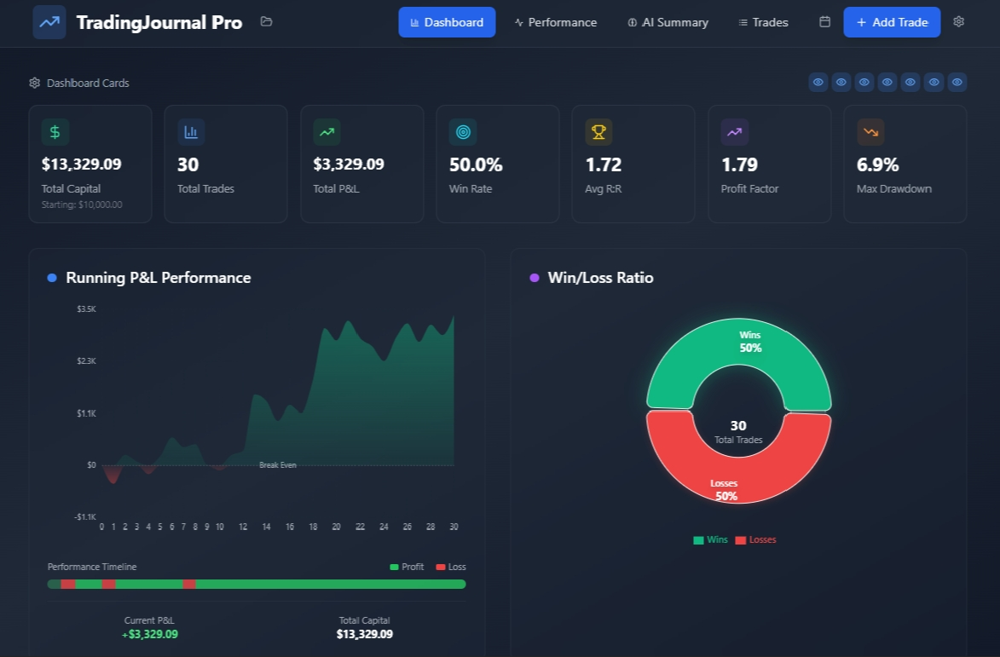
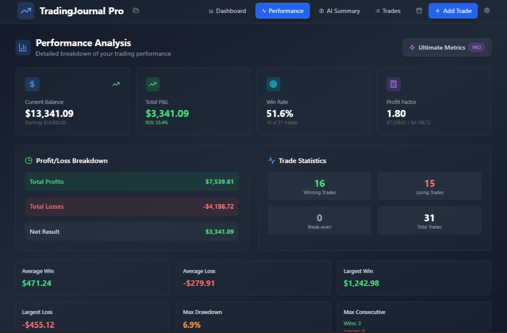
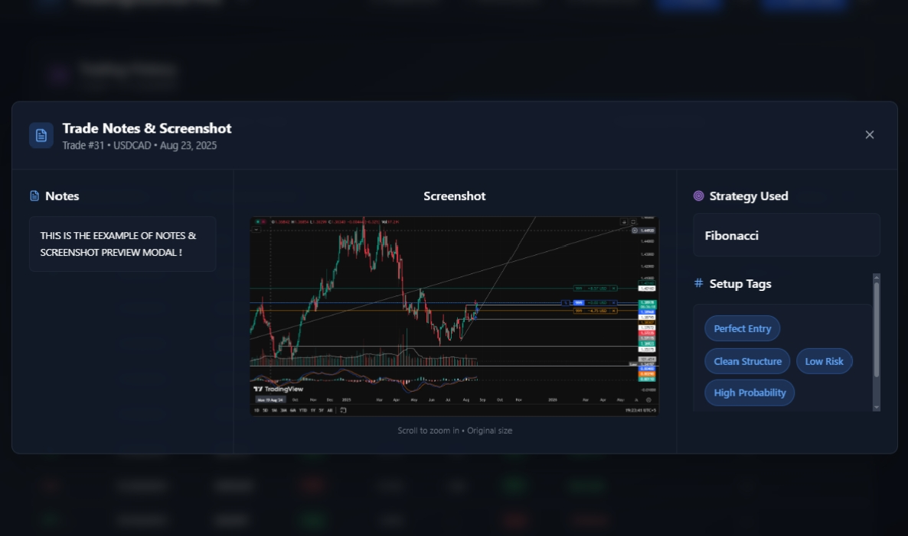
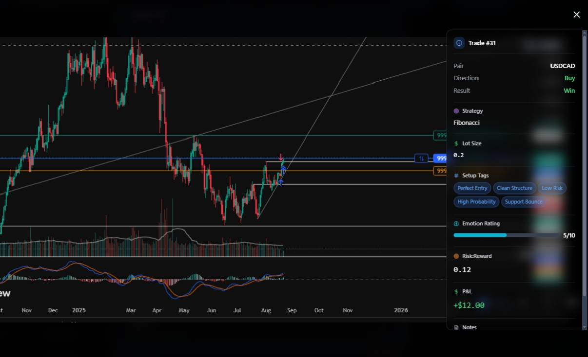
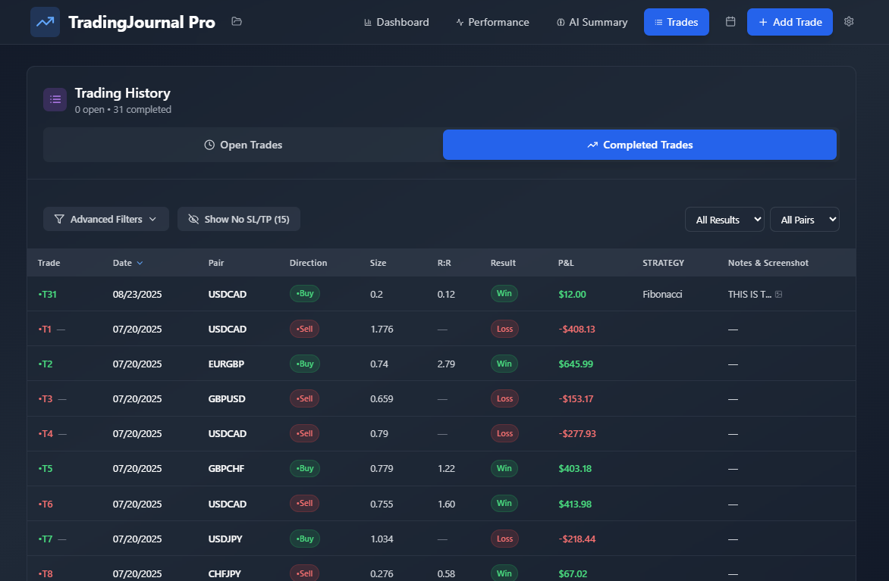
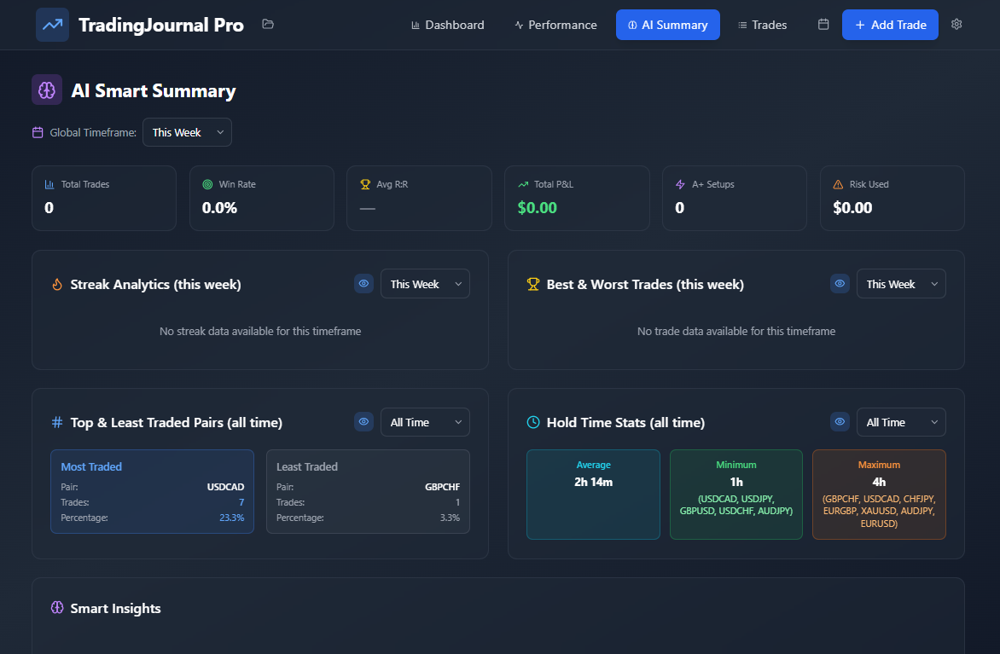

# TJ Pro — Trading Journal & Analytics

TJ Pro is a focused trading journal built for traders who want to record decisions, review performance, and turn trading history into clearer feedback. It combines structured trade logging with analytics, visual context, and practical performance insights in a professional dark interface.

## Live application

**Use TJ Pro:** [tj-pro-by-naxim.netlify.app](https://tj-pro-by-naxim.netlify.app)

The live deployment is the primary experience. This repository is a public product showcase containing documentation and interface previews. The original source code is not included because it is no longer available.

## Product highlights

TJ Pro brings the main parts of a trading review workflow into one place:

- **Dashboard analytics** for total capital, trade count, P&L, win rate, average risk-to-reward, profit factor, and maximum drawdown
- 
- **Performance analysis** with profit and loss breakdowns, trade statistics, average wins and losses, largest outcomes, and consecutive-trade metrics
- 
- **Trade history** with open and completed trade views, filters, pair selection, direction, size, R:R, result, P&L, strategy, and notes
- 
- **AI Smart Summary** with timeframe-based summaries, streak analytics, best and worst trades, traded-pair patterns, hold-time statistics, and smart insights
- 
- **Trade context** through notes, chart screenshots, strategy labels, setup tags, emotion ratings, risk-to-reward, and P&L
- 

## Built for deliberate review

TJ Pro is designed to make the review loop easier: record the trade, preserve the reasoning behind it, inspect the result, and look for repeatable patterns. The goal is not just to store trades, but to help traders understand their process.

## Interface preview

### Dashboard

The dashboard provides a high-level view of account performance, including running P&L and win/loss distribution.

### Performance analysis

Performance analysis expands the review with detailed profitability and trade-statistic breakdowns.

### Trade notes and chart context

Each trade can retain notes, a chart screenshot, the strategy used, and setup tags for later review.

### Trade detail

Trade detail brings execution metadata, setup context, emotion rating, risk-to-reward, and P&L together with the chart view.

### Trading history

The trading history view keeps open and completed trades organized with advanced filtering and sortable review fields.

### AI Smart Summary

The AI Smart Summary view is organized around timeframe-based insights, streaks, traded pairs, hold time, and best or worst trade patterns.

## Project status

TJ Pro is currently available as a live web application. This repository is maintained as a product presentation and visual reference because the original source files are unavailable.

## Disclaimer

TJ Pro is a journaling and analytics tool, not financial advice. Trading involves risk; use the application to document and review your own decisions responsibly.

## Links

- **Live app:** [tj-pro-by-naxim.netlify.app](https://tj-pro-by-naxim.netlify.app)
- 
- **Creator:** [@0naXim0](https://github.com/0naXim0)
- 

